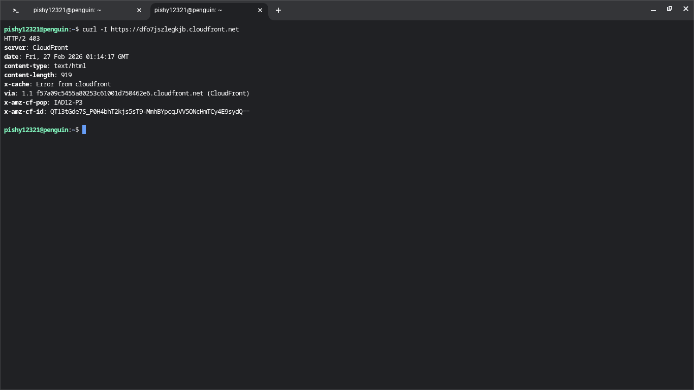

# Project 3: Secure Static Site with AWS WAF

This project demonstrates securing a static website hosted on CloudFront using AWS WAF. It includes creating Web ACLs, managed rules, IP blocking, and logging.

## Project Overview

- Host a static website on CloudFront
- Configure AWS WAF Web ACLs for security
- Add custom rules and managed rule sets
- Block specific IP addresses
- Enable logging with Amazon Data Firehose
- Test WAF protection

## Steps Completed

1. Created a Web ACL: `Project3-WebACL-2`
2. Added rules:
   - `BlockMyCurrentIP` (custom IP block)
   - AWS Managed Rules:
     - Amazon IP Reputation List
     - Common Rule Set
     - Known Bad Inputs Rule Set
3. Enabled logging via Firehose stream: `aws-waf-logs-Project3`
4. Tested blocked IP requests using `curl`
5. Verified CloudFront returns `403` for blocked IPs
6. Took 13 screenshots documenting each step

## Screenshots

### 01 - WAF Intro
  
This screenshot shows the AWS WAF console landing page, giving an overview of available Web ACLs, rules, and managed rule groups.

### 02 - Web ACL List
  
Displays the list of Web ACLs in the account. `Project3-WebACL-2` is highlighted as the Web ACL we are working with.

### 03 - BlockMyIP Rule
  
The custom IP block rule created to prevent a specific IP address from accessing the website.

### 04 - WAF Rule Builder
  
Shows the rule builder interface where you define statements, such as IP sets, headers, or query string inspection.

### 05 - WAF Rule JSON Editor
  
This screenshot demonstrates how to edit complex rule logic using the JSON editor for nesting statements.

### 06 - WAF IP Set Creation
  
Displays the creation of an IP set, which is referenced in the custom block rule.

### 07 - WAF Managed Rules
  
Shows the AWS managed rule groups added to the Web ACL to protect against bots, bad inputs, and IP reputation threats.

### 08 - Web ACL Basic Setup
  
Overview of the Web ACL settings, priorities, and rule actions before enabling logging.

### 09 - Active Rules
  
Shows the list of active rules in `Project3-WebACL-2` with their respective priorities and actions.

### 10 - WAF Access Denied
  
Demonstrates an access denied screen when attempting to view a resource blocked by WAF.

### 11 - Firehose Logging Enabled
  
Shows logging enabled via Amazon Data Firehose stream `aws-waf-logs-Project3` for auditing and monitoring requests.

### 12 - WAF Block Test (403)
  
Command-line `curl` test confirming that requests from blocked IPs are returned with HTTP `403`.

### 13 - Sampled Requests / Logs
  
Displays the WAF sampled requests interface. This shows requests matching your rules for verification, though it may take a few minutes for data to populate.

## Notes

- Some sampled requests may not appear immediately in WAF.
- Logging is enabled via Firehose stream `aws-waf-logs-Project3`.
- CloudFront distribution: `<your distribution ID>`
- Testing via `curl` confirmed blocked IP returns `403`.

## Repository Structure

Project3-WAF-Secure-Static-Site/
├── screenshots/
│   ├── 01-waf-intro.png
│   ├── 02-webacl-list.png
│   ├── 03-blockmyip-rule.png
│   ├── 04-rule-builder.png
│   ├── 05-rule-json.png
│   ├── 06-ipset.png
│   ├── 07-managed-rules.png
│   ├── 08-webacl-setup.png
│   ├── 09-active-rules.png
│   ├── 10-access-denied.png
│   ├── 11-firehose-logging.png
│   ├── 12-waf-block-test.png
│   └── 13-sampled-requests.png
└── README.md
