# Project 3: Secure Static Site with AWS WAF

This project demonstrates securing a static website hosted on CloudFront using AWS WAF. It includes creating Web ACLs, managed rules, IP blocking, and logging.

## Project Overview

- Host a static website on CloudFront  
- Configure AWS WAF Web ACLs for security  
- Add custom rules and managed rule sets  
- Block specific IP addresses  
- Enable logging with Amazon Data Firehose  
- Test WAF protection  

## Steps Completed

1. Created a Web ACL: `Project3-WebACL-2`  
2. Added rules:  
   - `BlockMyCurrentIP` (custom IP block)  
   - AWS Managed Rules:  
     - Amazon IP Reputation List  
     - Common Rule Set  
     - Known Bad Inputs Rule Set  
3. Enabled logging via Firehose stream: `aws-waf-logs-Project3`  
4. Tested blocked IP requests using `curl`  
5. Verified CloudFront returns `403` for blocked IPs  
6. Took 13 screenshots documenting each step  

## Screenshots

### 01 - S3 Bucket Private  
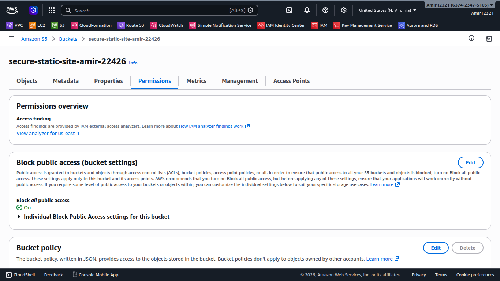  
Shows the S3 bucket configured as private for hosting the static website.  

### 02 - Index Uploaded  
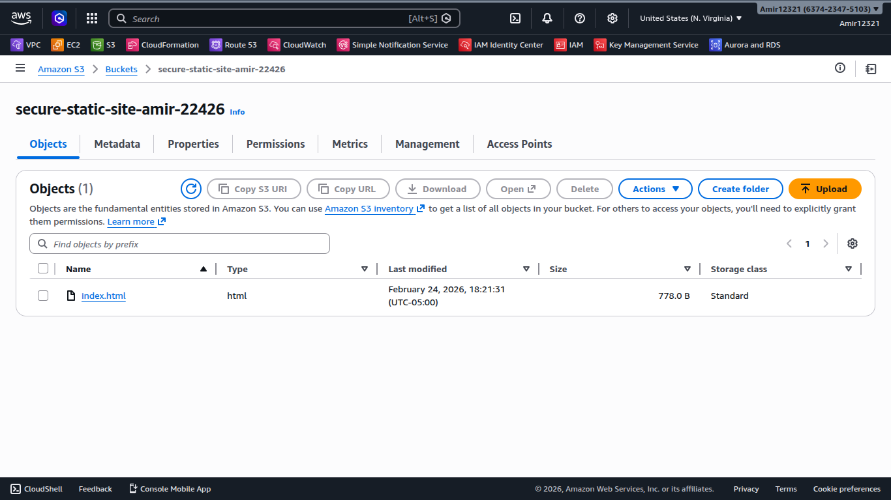  
Confirms the `index.html` file was uploaded to the S3 bucket.  

### 03 - Access Denied  
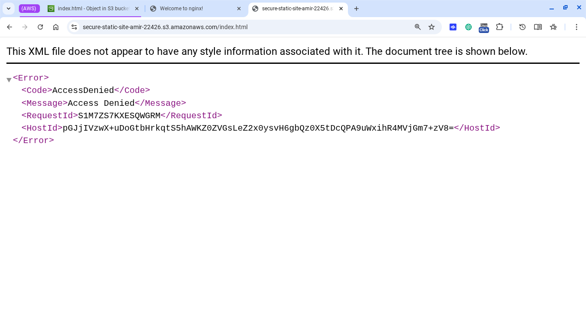  
Demonstrates that direct access to the private S3 bucket is blocked.  

### 04 - Nginx Running  
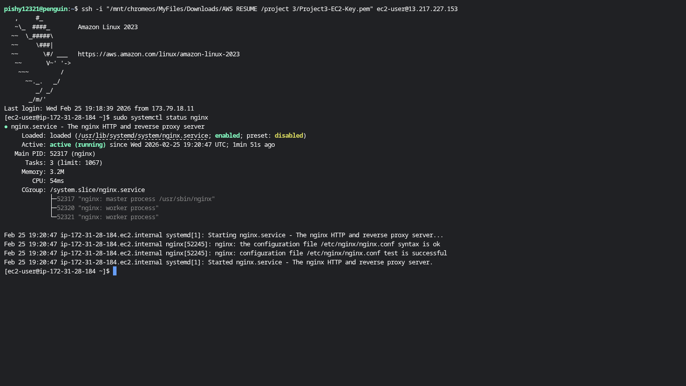  
Shows the Nginx server running locally (for testing before CloudFront).  

### 05 - Nginx Default Page  
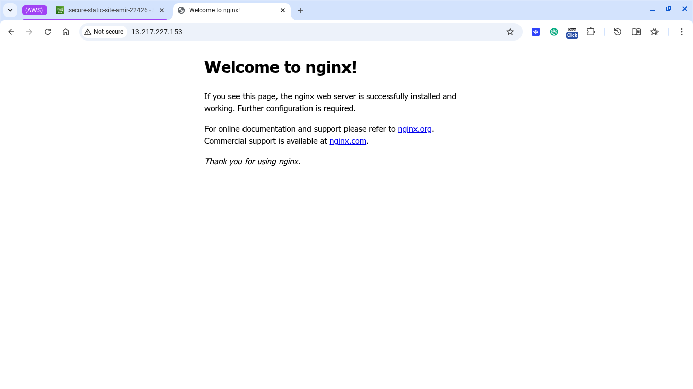  
Displays the default Nginx page served successfully.  

### 06 - S3 Private Access Denied  
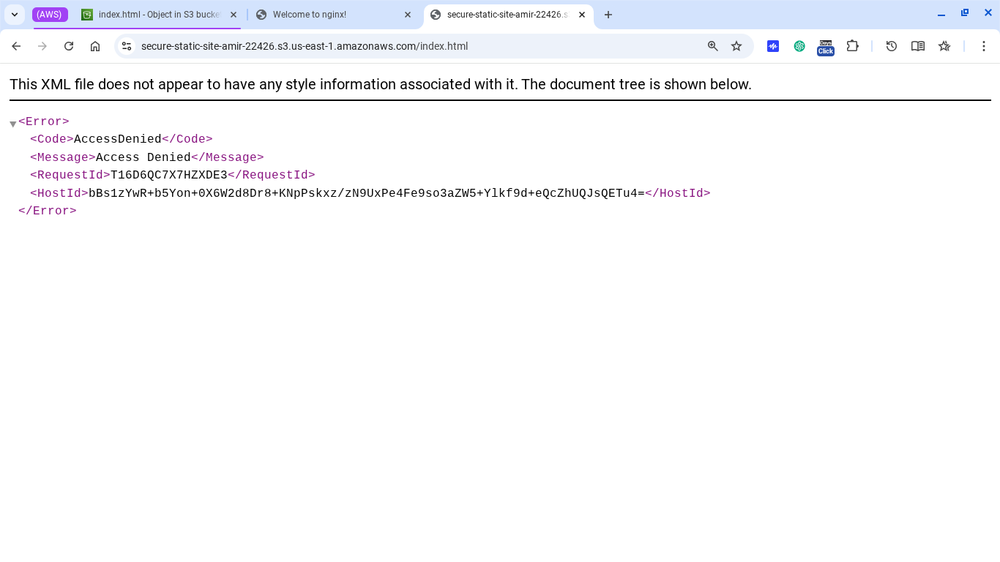  
Confirms that trying to access S3 files without CloudFront fails.  

### 07 - CloudFront Updated Page  
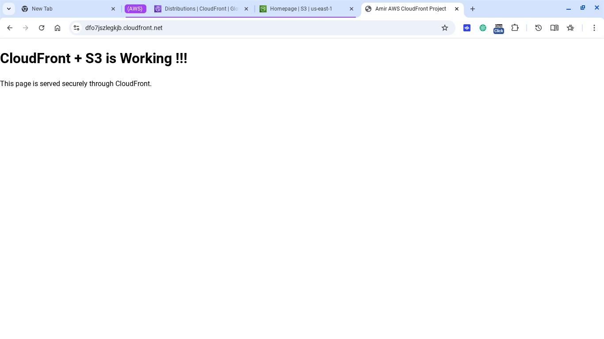  
Shows the CloudFront distribution serving the static website.  

### 08 - WAF Web ACL Basic Setup  
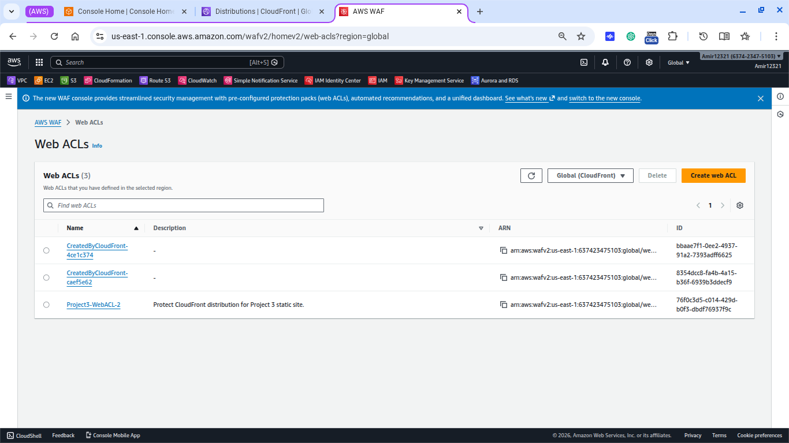  
Overview of the Web ACL settings, priorities, and rules before enabling logging.  

### 09 - Web ACL Active Rules  
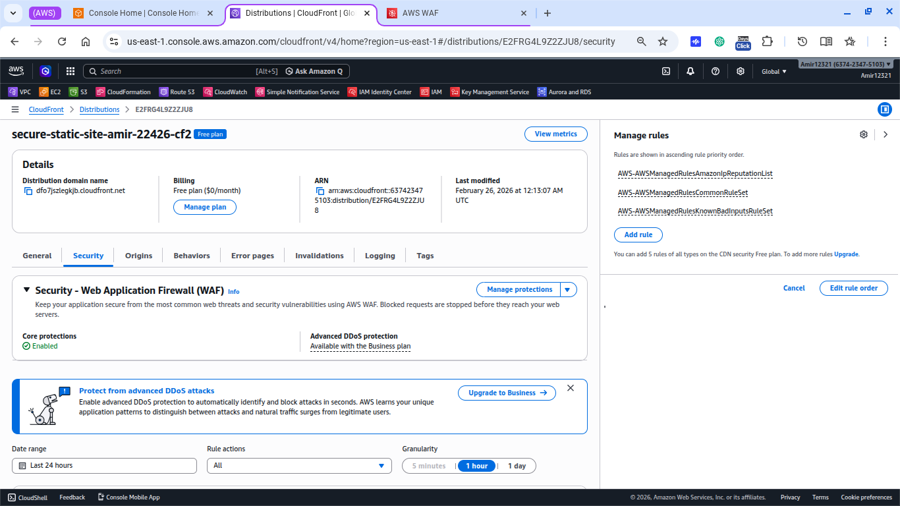  
Lists active rules in `Project3-WebACL-2` with priorities and actions.  

### 10 - WAF Access Denied  
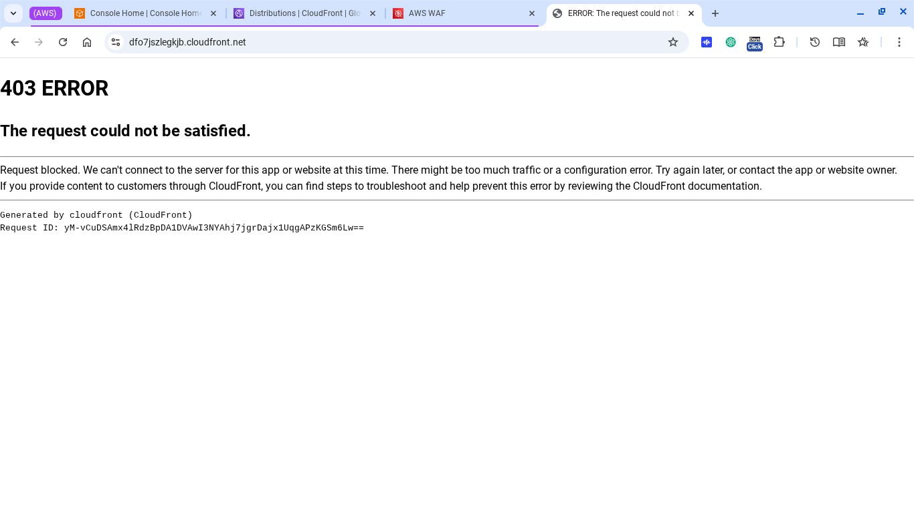  
Shows a blocked request being denied by WAF.  

### 11 - WAF Logging Active  
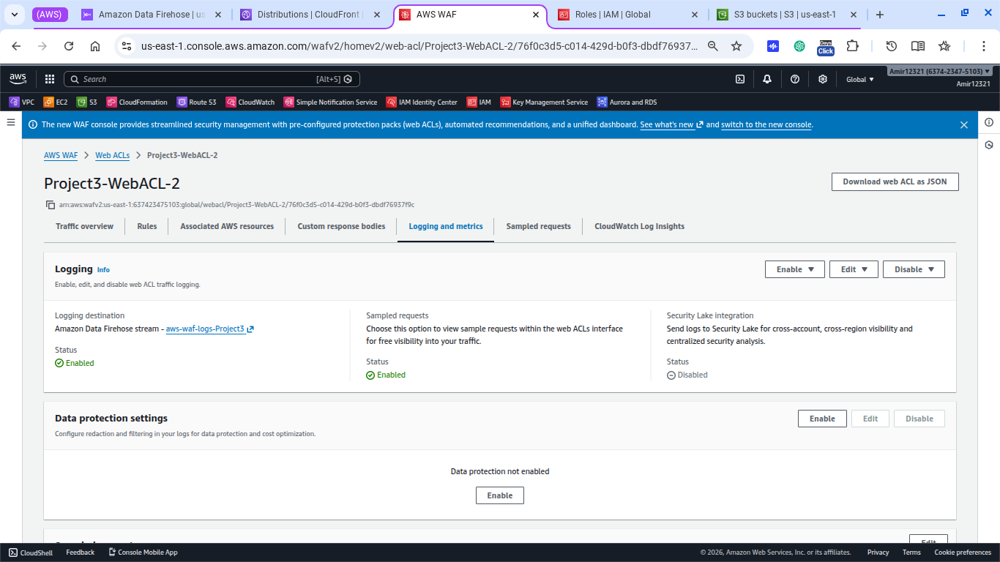  
Demonstrates logging enabled via the Firehose stream for monitoring requests.  

### 12 - WAF Block Test  
  
Command-line `curl` test showing requests from blocked IPs return HTTP `403`.  

### 13 - WAF Rule Enabled CloudFront  
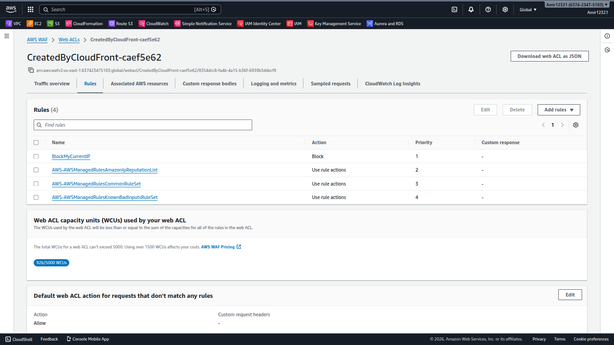  
Confirms the custom WAF rule is enabled and associated with the CloudFront distribution.  

## Notes

- Sampled requests may take a few minutes to appear in WAF.  
- Logging is enabled via Firehose stream `aws-waf-logs-Project3`.  
- CloudFront distribution: `<your distribution ID>`  
- Testing via `curl` confirmed blocked IP returns `403`.  

## Repository Structure

```text
Project3-WAF-Secure-Static-Site/
├── screenshots/
│   ├── 1-s3-bucket-private.png
│   ├── 2-index-uploaded.png
│   ├── 3-access-denied.png
│   ├── 4-nginx-running.png
│   ├── 5-nginx-default-page.png
│   ├── 6-s3-private-access-denied.png
│   ├── 7-cloudfront-updated-page.png
│   ├── 8-waf-webacl-basic-setup.png
│   ├── 9-webacl-active-rules.png
│   ├── 10-waf-access-denied.png
│   ├── 11-waf-logging-active.png
│   ├── 12-waf-block-test.png
│   └── 13-waf-rule-enabled-cloudfront.png
└── README.md
